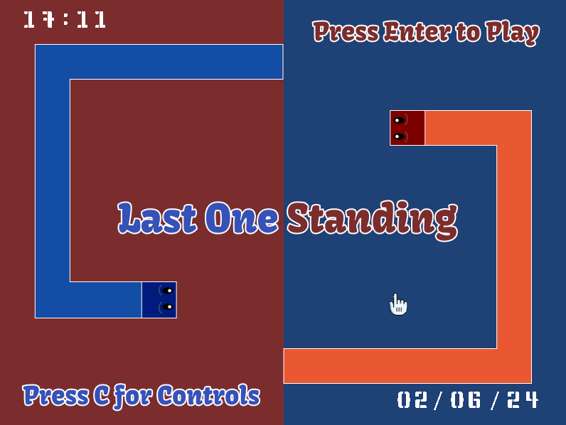
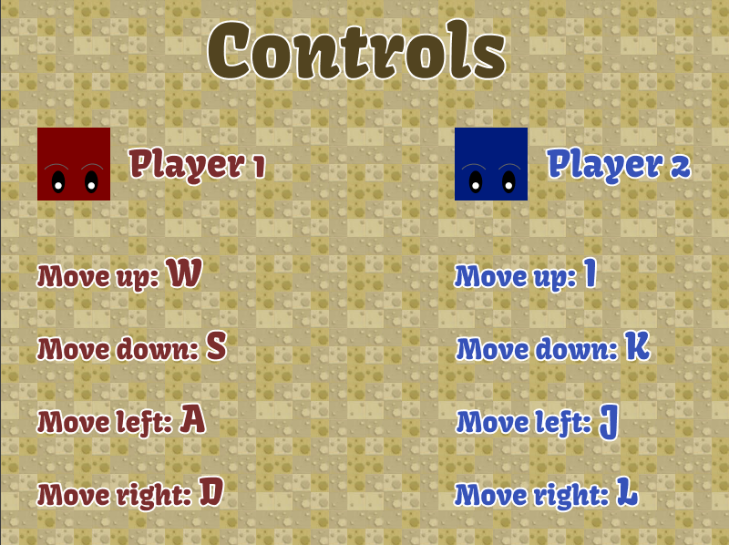
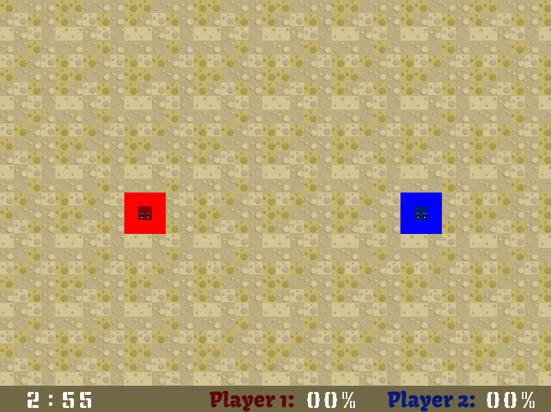

# Last One Standing

This project was developed as part of the Computer Laboratory (**second year, first semester**) in the classes using Minix operating system.

Last One Standing was inspired in a game from Discord named Land-io game.

## Main Menu

  

## Controls

  

## Arena

  

## Video

- The video demonstrating the game can be found at docs/LOS.mp4

## LCOM Project for group T12G02

### Group members:

1. Miguel Lopes Guerrinha (up202205038@fe.up.pt)
2. Miguel Duarte (up202206102@fe.up.pt)
3. Rui Cruz (up202208011@edu.fe.up.pt)
